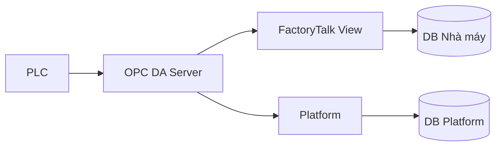

Convert an audio recording or transcription file into a Minutes of Meeting document.

The input file path is: $ARGUMENTS

## Steps

`<project_root>` = directory containing `transcribe.py`.
`MOM_ROOT` = `<project_root>/MOM`

Detect input type from the file extension:
- `.txt` → already a transcription, skip to step 2
- anything else → treat as audio, start from step 1

1. Prepare and transcribe audio:

   Use a temp dir first — final location is decided after reading content.
   ```
   AUDIO="$ARGUMENTS"
   SCRATCH=$(mktemp -d)
   MEAN_VOL=$(ffmpeg -i "$AUDIO" -filter:a volumedetect -f null /dev/null 2>&1 | grep mean_volume | awk '{print $5}')
   ```
   If `$MEAN_VOL` is below `-20` dB, normalize:
   ```
   ffmpeg -y -i "$AUDIO" -filter:a "loudnorm=I=-16:LRA=11:TP=-1.5" "$SCRATCH/normalized.wav"
   AUDIO_INPUT="$SCRATCH/normalized.wav"
   ```
   Otherwise `AUDIO_INPUT="$AUDIO"`. Then transcribe:
   ```
   python <project_root>/transcribe.py "$AUDIO_INPUT" \
     --output_format txt --output_dir "$SCRATCH/"
   ```
   Transcript is at `$SCRATCH/<audio_basename>.txt`.

2. Read the **entire** transcript before writing anything. Technical, commercial, and
   administrative content matter equally — do not skip late-recording sections.

   **Transcription quality notice:** The transcript is machine-generated and likely contains
   errors — misspelled names, wrong technical terms, misheared numbers, missing punctuation,
   run-on sentences. Do NOT transcribe errors literally into the MoM. Instead:
   - Use context to infer the correct meaning (e.g. "cái no" → "cái nọ", "OPC DA" vs "OP CDA")
   - Reconstruct broken sentences into proper Vietnamese
   - When a number or proper noun sounds ambiguous, note uncertainty only if it materially
     affects a decision or action item
   - Prefer confident reconstruction over hedging — the MoM should read like clean notes,
     not a corrected transcript

   If the transcript contains `[MM:SS]` or `[HH:MM:SS]` time markers, use them to anchor
   topic sections and cross-reference with the audio if needed.

   **Ask before guessing:** After reading the transcript, if any of the following are unclear,
   ask the user before writing the MoM — do not invent or guess:
   - Participant names (transcription distorts names heavily — list what you heard and ask
     for confirmation or correction, e.g. "Tôi nghe thấy 'Anh Minh', 'Chị Lan', 'bạn Tuấn' —
     có đúng không và họ tên đầy đủ là gì?")
   - Proper nouns: company names, product names, project codes
   - Key numbers that affect decisions (budget, deadlines, targets)
   - Any decision or action item where the transcript is too fragmented to reconstruct confidently

   For everything else (content, structure, tone) — reconstruct and write confidently.

3. Determine MoM language:
   - Detect the dominant language of the transcript (look at majority of speech, not isolated words)
   - If clearly one language → write MoM in that language
   - If mixed / unclear → ask the user: "Transcript có vẻ sử dụng nhiều ngôn ngữ. Bạn muốn MoM viết bằng ngôn ngữ nào — tiếng Việt, English, hay song ngữ (bilingual)?"
   - If user requests **bilingual** → follow the bilingual format in the guidelines below

4. Set up output directory (do this AFTER reading the transcript so the name is meaningful):

   **Derive `SLUG`** from the meeting content:
   - kebab-case, 3–5 words that describe the meeting's main subject
   - Prefix with `YYYY-MM-` if a date is identifiable: `2026-07-api-architecture-review`
   - Never use generic words: `meeting`, `discussion`, `transcription`, `audio`, `recording`
   - Good examples: `api-platform-architecture-review`, `nhatviet-getskaWire-bid`, `q3-sales-kickoff`

   **If the source file is already inside `MOM_ROOT/`** (user pre-organized it):
   - `OUTDIR` = parent directory of the source file
   - `BASENAME` = SLUG (derived above, not the original filename)

   **If the source file is outside `MOM_ROOT/`** (raw drop):
   ```
   OUTDIR="$MOM_ROOT/$SLUG"
   mkdir -p "$OUTDIR/tmp"
   cp "$ARGUMENTS" "$OUTDIR/"
   ```
   For audio input, also move transcript and clean up scratch:
   ```
   mv "$SCRATCH/<audio_basename>.txt" "$OUTDIR/$SLUG.txt"
   rm -rf "$SCRATCH"
   ```
   `BASENAME` = SLUG

   Tmp/intermediate files (normalized audio, etc.) go in `$OUTDIR/tmp/`.

5. Write the Minutes of Meeting to `$OUTDIR/$BASENAME.md` using the guidelines below.

6. Export HTML and PDF:
   ```
   python <project_root>/mom_export.py "$OUTDIR/$BASENAME.md"
   ```

7. Print all three output paths (`.md`, `.html`, `.pdf`).

---

## Writing the Minutes of Meeting

### Structure — follow the content, not a fixed template

Identify every major topic discussed, then build sections around those topics. Do not
force content into a generic outline. Use `##` for each major topic, `###` for subtopics.

**Always include at the top:**

```markdown
# Biên bản cuộc họp
**Ngày:** <date — extract from filename or use today>
**File gốc:** <audio/transcript filename>

## Tóm tắt
<2–3 sentences that cover every major area discussed, not just the technical parts>

## Người tham dự
<All names heard in transcript. "Không xác định" only if no names appear at all.>
```

**Always end with:**

```markdown
## Quyết định
<Bullets or table — what was decided and the reason behind each decision>

## Hành động tiếp theo
| STT | Nội dung | Người thực hiện | Hạn hoàn thành |
|-----|----------|-----------------|----------------|
| 1   | ...      | ...             | ...            |
```

Every action item must have an owner and a deadline — write "Chưa xác định" if missing,
never omit the row.

### Highlights

Use inline HTML marks to draw attention to key items — sparingly (1–3 per section):

- <mark class="yellow">text</mark> — important, neutral → write as: `<mark class="yellow">text</mark>`
- <mark class="green">text</mark> — approved / confirmed / resolved → write as: `<mark class="green">text</mark>`
- <mark class="red">text</mark> — rejected / blocked / risk → write as: `<mark class="red">text</mark>`
- <mark class="blue">text</mark> — pending / TBD / needs follow-up → write as: `<mark class="blue">text</mark>`

**IMPORTANT:** Write mark tags as raw HTML directly in the paragraph — never wrap them in backticks.
- CORRECT: `<mark class="red">Bị bác bỏ</mark>`  (inside the sentence, no backticks around the tag itself)
- WRONG: `` `<mark class="red">` ``Bị bác bỏ`` `</mark>` ``

### Diagrams

When a data flow, system architecture, or process is discussed and a visual would make
it clearer — draw it. Keep diagrams minimal: clear node labels, no more nodes than
necessary, avoid crossing arrows.

Use Mermaid in a fenced code block:



- Prefer `flowchart LR` for data/signal flows
- Use `sequenceDiagram` for step-by-step interactions
- Use `graph TD` only when hierarchy matters
- One diagram per topic maximum; skip if the prose is already clear

### Bilingual format

When the user requests a bilingual MoM, wrap each section's content (not the headings) in a two-column div. Use `markdown="1"` so markdown inside the divs is rendered:

```html
<div class="bilingual">
<div class="lang-col" markdown="1">
<div class="lang-label">Tiếng Việt</div>

Nội dung tiếng Việt ở đây...

</div>
<div class="lang-col" markdown="1">
<div class="lang-label">English</div>

English content here...

</div>
</div>
```

Rules for bilingual:
- Section **headings** (`##`, `###`) use the format `Tiêu đề / Heading` (Vietnamese first, English second)
- Tables (Hành động tiếp theo / Action Items) get duplicated columns: Vietnamese label | English label in each `th`
- Header block at the top: add both language versions of metadata labels
- Keep both columns at the same level of detail — do not summarize one and expand the other

### Completeness checklist (review before saving)

- [ ] All major topics extracted — technical, commercial, administrative
- [ ] All names in Người tham dự
- [ ] Every decision in Quyết định (with rationale if stated)
- [ ] Every action item has an owner and deadline
- [ ] No section is just a vague summary when specific bullet points are possible
